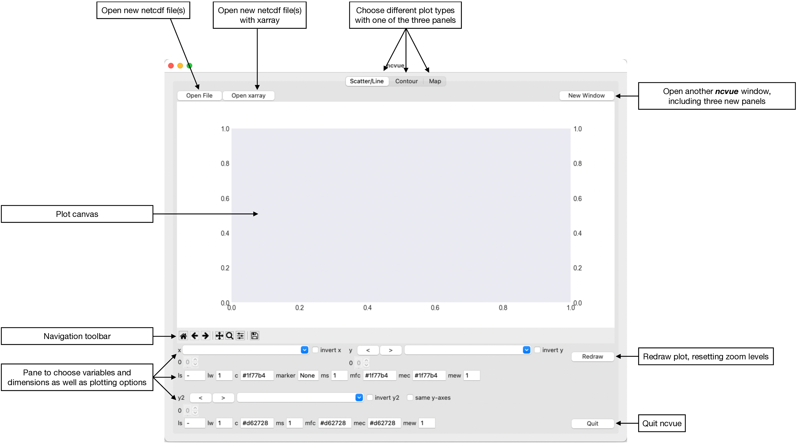
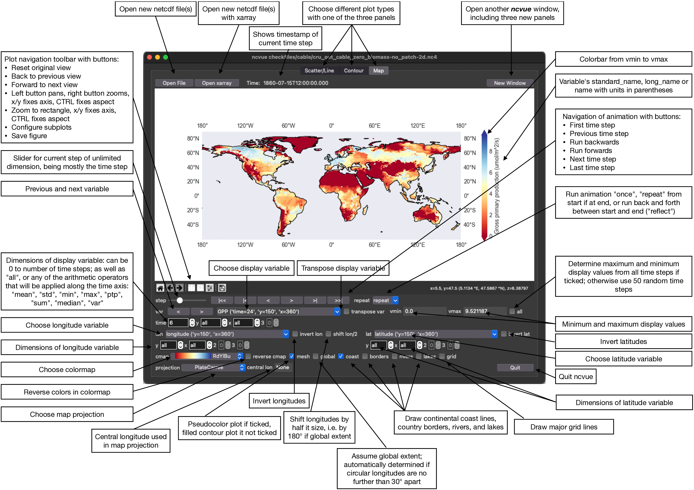
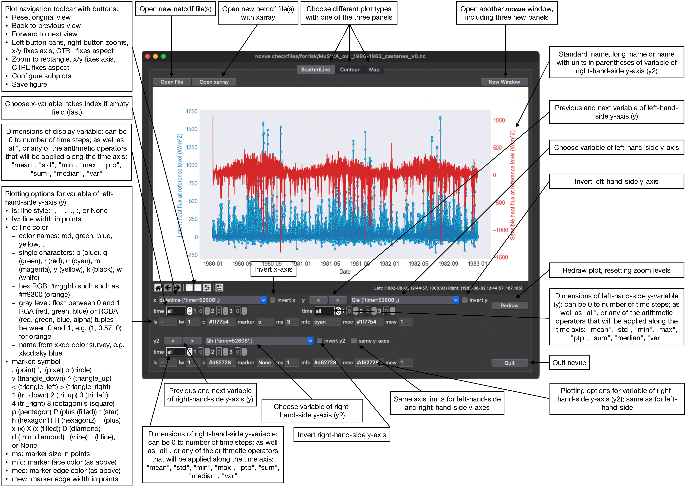
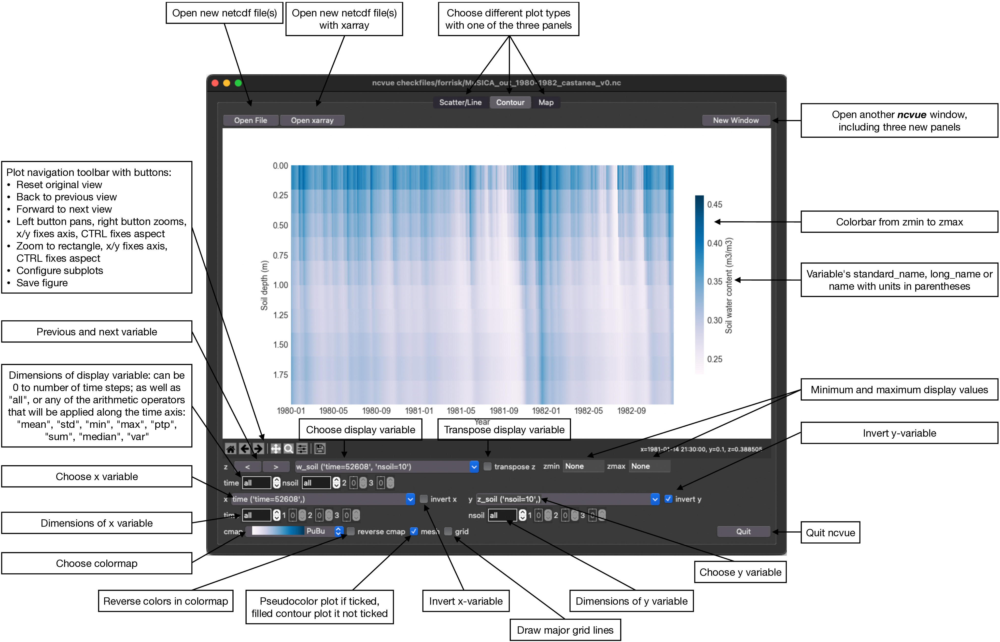

ncvue - A GUI to view netCDF files
==================================
..
  pandoc -f rst -o README.html -t html README.rst
  As docs/src/readme.rst:
    replace docs/ with ../
    replace _small.png with .png
    replace
      higher resolution images can be found in the documentation_
    with
      click on figures to open larger pictures
    remove section "Installation"

A minimal GUI for a quick view of netCDF files. Aiming to be a drop-in
replacement for ncview_.

.. image:: https://zenodo.org/badge/DOI/10.5281/zenodo.3893705.svg
   :alt: Zenodo DOI
   :target: https://doi.org/10.5281/zenodo.3893705

.. image:: https://badge.fury.io/py/ncvue.svg
   :alt: PyPI version
   :target: https://badge.fury.io/py/ncvue

.. image:: http://img.shields.io/badge/license-MIT-blue.svg?style=flat
   :alt: License
   :target: https://github.com/mcuntz/ncvue/blob/master/LICENSE

.. image:: https://travis-ci.org/mcuntz/ncvue.svg?branch=main
   :alt: Build status
   :target: https://travis-ci.org/mcuntz/ncvue

About ncvue
-----------

``ncvue`` is a minimal GUI for a quick view of netCDF files. It is aiming to be
a drop-in replacement for ncview_, being slightly more general than ncview,
which targets maps. If ``ncvue`` is used with maps, it supports mostly
structured grids, more precisely the grids supported by cartopy_.

``ncvue`` is a Python script that can be called from within Python or as a
command line tool. It is not supposed to produce publication-ready plots but
rather provide a quick overview of the netcdf file.

The complete documentation for ``ncvue`` is available from:

   https://mcuntz.github.io/ncvue/

Quick usage guide
-----------------

``ncvue`` can be run from the command line:

.. code-block:: bash

   ncvue netcdf_file.nc

or from within Python:

.. code-block:: python

   from ncvue import ncvue
   ncvue('netcdf_file.nc')

Note, ``ncvue`` uses the `TkAgg` backend of `matplotlib`. It must be called
before any other call to `matplotlib`. This also means that you cannot launch it
from within `iPython` if it was launched with `--pylab`. It can be called from
within a standard `iPython`, though.

General layout
^^^^^^^^^^^^^^

On opening, ``ncvue`` presents three panels for different plotting types:
Scatter or Line plots, Contour plots, and Maps. This is the look in macOS light
mode (click on figures to open larger pictures):

..
   :height: 462 px

All three panes are organised in this fashion: the plotting canvas, the
Matplotlib navigation toolbar and the pane, where one can choose the plotting
variables and dimensions, as well as plotting options. You can always choose
another panel on top, and open another, identical window for the same netCDF
file with the button "New Window" on the top right.

Map panel
^^^^^^^^^

If ``ncvue`` detects latitude and longitude variables with a size greater than
1, it opens the Map panel by default. This is the Map panel in macOS dark mode,
describing all buttons, sliders, entry boxes, spinboxes, and menus:

If it happens that the detection of latitudes and longitudes did not work
automatically, you can choose the correct variables manually. Or you might use
the empty entries on top of the dropdown menus of the latitudes and longitudes,
which uses the index and one can hence display the matrix within the netCDF
file. You might want to switch of the coastlines in this case.

You might want to switch off the automatically detected "global" option
sometimes if your data is on a rotated grid or excludes some regions such as
below minus -60 °S.

All dimensions can be set from 0 to the size of the dimension-1, to "all", or to
any of the arithmetic operators "mean", "std" (standard deviation), "min",
"max", "ptp" (point-to-point amplitude, i.e. max-min), "sum", "median", "var"
(variance).

Be aware that the underlying cartopy/matplotlib may (or may not) need a long
time to plot the data (with the pseudocolor 'mesh' option) if you change the
central longitude of the projection from the central longitude of your data,
which is automatically detected if "central lon" is set to None. Setting
"central lon" to the central longitude of the input data normally eliminates the
problem.

Scatter/Line panel
^^^^^^^^^^^^^^^^^^

If ``ncvue`` does not detect latitude and longitude variables with a size
greater than 1, it opens the Scatter/Line panel by default. This is the
Scatter/Line panel in macOS dark mode, describing all buttons, sliders, entry
boxes, spinboxes, and menus:

The default plot is a line plot with solid lines (line style 'ls' is '-'). One
can set line style 'ls' to None and set a marker symbol, e.g. 'o' for circles, to
get a scatter plot. A large variety of line styles, marker symbols and color
notations are supported.

``ncvue`` builds automatically a `datetime` variable from the time axis. This is
correctly interpreted by the underlying Matplotlib also when zooming into or
panning the axes. But it is also much slower than using the index. Selecting the
empty entry on top of the dropdown menu for `x` uses the index for the x-axis
and is very fast. Plotting a line plot with 52608 time points takes about 2.2 s
on my Macbook Pro using the `datetime` variable and about 0.3 s using the index
(i.e. empty x-variable). This is especially true if one plots multiple lines
with 'all' entries from a specific dimension. Plotting all 10 depths of soil
water content for the 52608 time points, as in the example below, takes also
about 0.3 s if using the index as x-variable but more than 11.1 s when using the
`datetime` variable.

.. image:: ../images/scatter_panel_dark_multiline.png
   :width: 407 px
   :align: center
   :alt: Example of multiple lines in the Scatter/Line panel

Contour panel
^^^^^^^^^^^^^

The last panel provide by ``ncvue`` draws contour plots. This is the
Contour panel in macOS dark mode, describing all buttons, sliders, entry
boxes, spinboxes, and menus:

This produces also either pseudocolor plots ('mesh' ticked) or filled
contour plots ('mesh' unticked) just as the Map panel but without any map
projection.

License
-------

``ncvue`` is distributed under the MIT License. See the LICENSE_ file for
details.

Copyright (c) 2020-2021 Matthias Cuntz

The project structure is based on a template_ provided by Sebastian Müller_.

.. _Anaconda: https://www.anaconda.com/products/individual
.. _cartopy: https://scitools.org.uk/cartopy/docs/latest/
.. _Conda: https://docs.conda.io/projects/conda/en/latest/
.. _documentation: https://mcuntz.github.io/ncvue/
.. _instructions: https://mcuntz.github.io/ncvue/install.htm
.. _LICENSE: https://github.com/mcuntz/ncvue/blob/main/LICENSE
.. _matplotlib: https://matplotlib.org/
.. _Miniconda: https://docs.conda.io/en/latest/miniconda.html
.. _Müller: https://github.com/MuellerSeb
.. _ncview: http://meteora.ucsd.edu/~pierce/ncview_home_page.html
.. _netcdf4: https://unidata.github.io/netcdf4-python/netCDF4/index.html
.. _numpy: https://numpy.org/
.. _template: https://github.com/MuellerSeb/template
